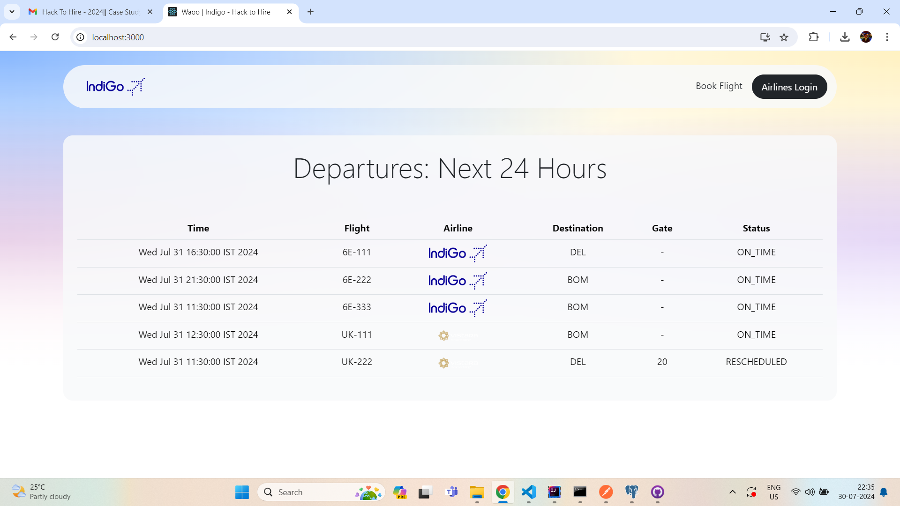
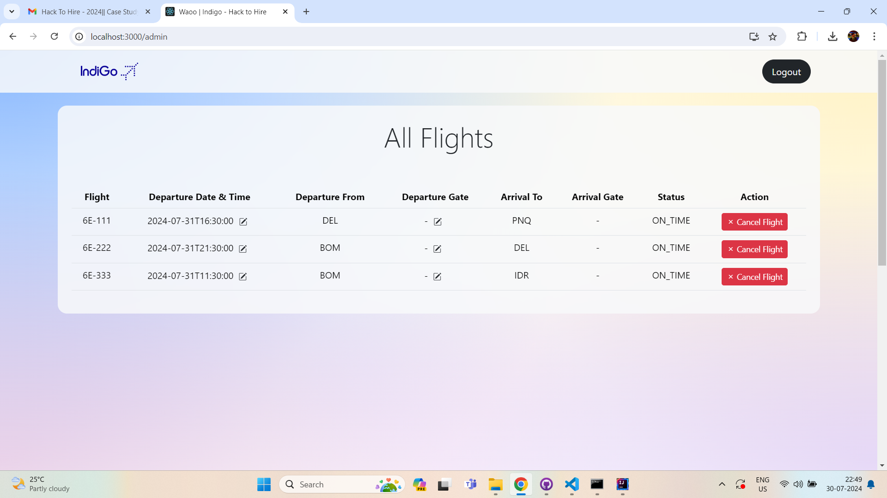
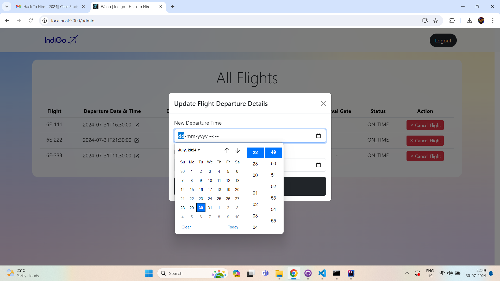
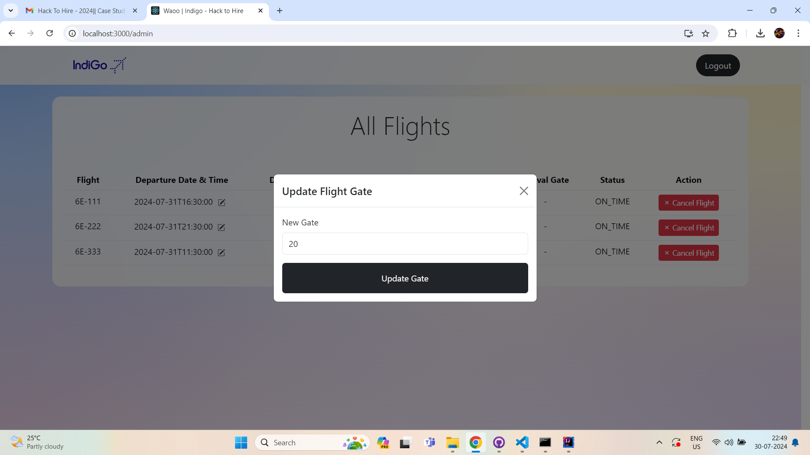
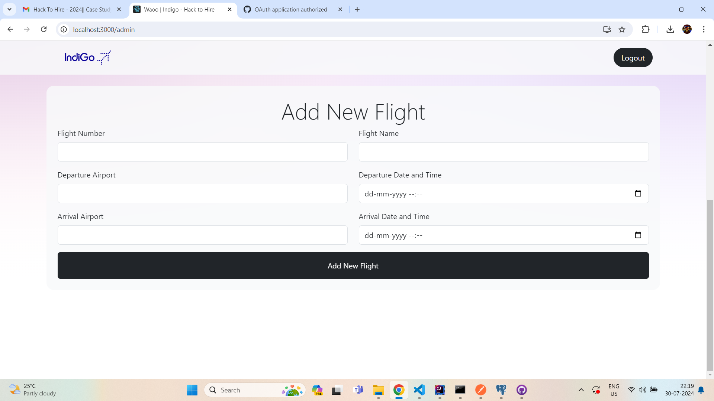
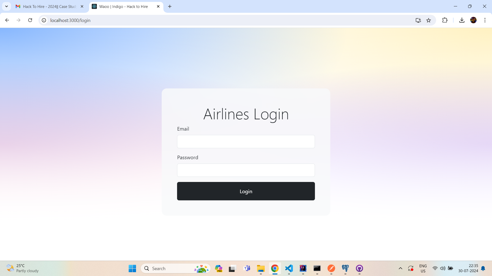

# Hack to Hire - FrontEnd #

### *summary* ###

The frontend of the real-time notification system is designed to provide an interactive and seamless user experience using the following technologies:

- ReactJS is utilized to build the user interface, ensuring a dynamic and responsive experience for users accessing the system from web browsers. It allows for efficient rendering of real-time data.

- StompJS is integrated with WebSocket to handle real-time messaging. It subscribes to the WebSocket server to receive flight status updates automatically and displays the information to the users instantly.

- The WebSocket connection ensures that the frontend receives updates from the backend in real-time, eliminating the need for manual refreshes or polling mechanisms.


This push-based system ensures that passengers are informed of any changes in flight status through various channels, such as email, WhatsApp, and display units at the airport, providing a comprehensive and efficient notification mechanism.

### *Tech Used* ###
- ReactJS
- STOMP JS (for real time communication over websocket)
- Bootstrap



### *Feature* ###
- Real time pushed based flight information (No need to pull from server)
- Secure Login, Logout and Admin page with accesstoken
- User can Book flight


### *What Admin can do?* ###

Admin can do the following actions
- Reschedule Flight
- Cancel Flight
- Change Boarding Gate
- Add New flight on a route








### *Starting Application* ###

To start frontend application simply run (Please note that backend server should be started first to run app smoothly)

```
npm start
```